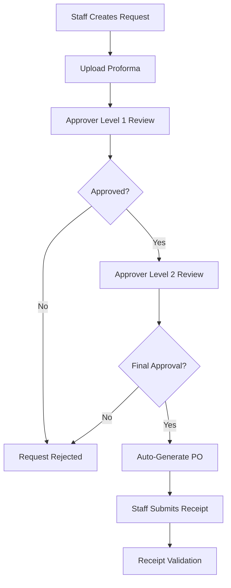

# 🏢 Procure-to-Pay System

[](https://djangoproject.com/)
[](https://reactjs.org/)
[](https://www.typescriptlang.org/)
[](https://www.docker.com/)
[](LICENSE)

A comprehensive **Procure-to-Pay** system with Django REST API backend and React TypeScript frontend, featuring multi-level approval workflows, AI-powered document processing, and Render PostgreSQL database.


## ✨ Features

### 🔐 Authentication & Authorization
- Multi-role user system (Staff, Approver Level 1/2, Finance)
- JWT-based authentication
- Role-based access control (RBAC)

### 📋 Purchase Request Management
- Create and track purchase requests
- Multi-level approval workflow
- Status tracking (Pending → Approved/Rejected)
- Automatic Purchase Order generation

### 🤖 AI-Powered Document Processing
- OCR for image-based documents
- PDF text extraction
- Proforma and receipt validation
- Automatic data extraction

### 📁 File Management
- Secure file uploads
- Support for proformas, purchase orders, receipts
- Document validation and processing

## 🛠️ Tech Stack

<table>
<tr>
<td><strong>Backend</strong></td>
<td><strong>Frontend</strong></td>
<td><strong>Database & Cache</strong></td>
<td><strong>DevOps</strong></td>
</tr>
<tr>
<td>

- Django 4.2
- Django REST Framework
- JWT Authentication
- Celery
- pytesseract (OCR)
- pdfplumber

</td>
<td>

- React 18
- TypeScript
- Material-UI
- React Query
- Axios
- React Router

</td>
<td>

- Render PostgreSQL
- Redis
- File Storage

</td>
<td>

- Docker
- Docker Compose
</td>
</tr>
</table>

## 🚀 Quick Start

### Prerequisites
- [Docker](https://www.docker.com/) and Docker Compose
- [Git](https://git-scm.com/)

### 📦 Installation

1. **Clone the repository**
   ```bash
   git clone https://github.com/manziosee/procure-to-pay-system.git
   cd procure-to-pay-system
   ```

2. **Choose your setup method:**

   **Development Setup (Uses Render PostgreSQL)**
   ```bash
   docker-compose up --build
   ```

   **Production Setup**
   ```bash
   docker-compose -f docker-compose.prod.yml up --build
   ```

3. **Access the applications**
   - 🌐 **Frontend**: http://localhost:3000
   - 🔧 **Backend API**: http://localhost:8000
   - 📚 **Swagger UI**: http://localhost:8000/api/docs/
   - 📖 **ReDoc**: http://localhost:8000/api/redoc/
   - 🔗 **API Schema**: http://localhost:8000/api/schema/

4. **Demo Users (Auto-created)**
   - **Staff**: staff1@example.com / password123
   - **Approver L1**: approver1@example.com / password123
   - **Approver L2**: approver2@example.com / password123
   - **Finance**: finance1@example.com / password123

## 🌐 Live Demo

**Frontend Application**: https://procure-to-pay-system.vercel.app/  
**Backend API**: https://procure-to-pay-system-xnwp.onrender.com/  
**Swagger UI**: https://procure-to-pay-system-xnwp.onrender.com/api/docs/  
**ReDoc**: https://procure-to-pay-system-xnwp.onrender.com/api/redoc/  
**Health Check**: https://procure-to-pay-system-xnwp.onrender.com/health/

## 🎨 UI/UX Features

### 🖤 **Clean Black & White Design**
- Professional black and white color scheme
- Consistent styling across all pages
- Hover effects and smooth transitions
- Accessible contrast ratios

### 📱 **Responsive Interface**
- Mobile-first responsive design
- Dynamic navigation with scroll effects
- Interactive buttons with hover animations
- Clean form layouts with proper validation

### 🔘 **Enhanced User Experience**
- **Role-Based Interface**: Different actions for different user roles
- **Approval Tracking**: Individual approval statistics for approvers
- **Export Functionality**: Finance users can export request data
- **Document Management**: Support for PDF and various document formats
- **Visible approve/reject buttons**: Available for both Level 1 & 2 approvers
- **Modal dialogs**: Confirmation actions with proper error handling
- **Real-time form validation**: Instant feedback on form inputs
- **Loading states**: Smooth transitions and loading indicators

#
### 🧪 Test the API

```bash
python3 test_api.py
```

## 📡 API Endpoints

| Method | Endpoint | Description | Access |
|--------|----------|-------------|--------|
| `POST` | `/api/auth/login/` | User authentication | Public |
| `GET` | `/api/auth/profile/` | Get user profile | Authenticated |
| `GET` | `/api/requests/` | List requests (role-filtered) | Authenticated |
| `POST` | `/api/requests/` | Create new request | Staff |
| `GET` | `/api/requests/{id}/` | Get request details | Authenticated |
| `PUT` | `/api/requests/{id}/` | Update request | Staff (pending only) |
| `PATCH` | `/api/requests/{id}/approve/` | Approve request | Approvers |
| `PATCH` | `/api/requests/{id}/reject/` | Reject request | Approvers |
| `POST` | `/api/requests/{id}/submit-receipt/` | Submit receipt | Staff |
| `POST` | `/api/documents/process/` | Process document | Authenticated |

**📖 Complete API Documentation**: [API_DOCUMENTATION.md](API_DOCUMENTATION.md)  
**🔧 Swagger Documentation**: [SWAGGER_ENDPOINTS.md](SWAGGER_ENDPOINTS.md)

## 👥 User Roles & Permissions

| Role | Permissions |
|------|-------------|
| **👤 Staff** | • Create purchase requests<br>• View own requests<br>• Submit receipts<br>• Upload proformas |
| **✅ Approver Level 1** | • Review pending requests<br>• Approve/reject requests<br>• View request history |
| **✅ Approver Level 2** | • Final approval authority<br>• Review Level 1 approved requests<br>• Generate purchase orders |
| **💰 Finance** | • View all requests<br>• Export request data<br>• Access financial reports<br>• Upload financial documents<br>• Monitor budget compliance |

## 🔄 Approval Workflow



**Process Steps:**
1. 📝 Staff creates purchase request with proforma
2. 👀 Request goes to Approver Level 1
3. ✅ If approved, moves to Approver Level 2
4. 🏁 Final approval triggers automatic PO generation
5. 🧾 Staff submits receipt for validation

## ✨ Implementation Highlights

### 🔒 **Security & Authentication**
- JWT-based authentication with refresh tokens
- Role-based access control (RBAC)
- Secure file uploads with validation
- CORS protection

### 🔄 **Business Logic**
- **Multi-level approval workflow**: Level 1 → Level 2 → Approved
- **Dual approval requirement**: Both Level 1 AND Level 2 must approve
- **Immediate rejection**: Any approver can reject instantly
- **Immutable status**: Once approved/rejected, cannot be changed
- **Automatic PO generation**: Triggered on final approval
- **Concurrent safety**: Database transactions prevent race conditions

### 🎯 **Approval Process Details**
- **Pending Status**: Request awaits approvals
- **Level 1 Approval**: First approver reviews and approves
- **Level 2 Approval**: Second approver provides final approval
- **Individual Tracking**: Each approver sees their personal approval statistics
- **Status Change**: Only changes to 'approved' when BOTH levels approve
- **Rejection**: Any level can reject, immediately changing status to 'rejected'
- **Approval History**: Complete tracking of who approved/rejected at each level

### 🤖 **AI Integration**
- **OCR Processing**: Extract text from images using pytesseract
- **PDF Processing**: Extract data from PDF documents
- **OpenAI Integration**: Intelligent data extraction from documents
- **Receipt Validation**: Compare receipts against purchase orders

### 📊 **Data Models**
- **User**: Extended with roles and departments
- **PurchaseRequest**: Core entity with file attachments and export capabilities
- **RequestItem**: Line items for detailed tracking
- **Approval**: Multi-level approval tracking with individual statistics
- **DocumentProcessing**: AI extraction results for uploaded documents

### 🔧 Configuration

See [DEPLOYMENT.md](DEPLOYMENT.md) for complete environment setup.

## 💻 Development

### Backend Development
```bash
cd backend
python -m venv venv
source venv/bin/activate  # On Windows: venv\Scripts\activate
pip install -r requirements.txt
python manage.py migrate
python manage.py create_demo_users
python manage.py runserver
```

### Frontend Development
```bash
cd frontend
npm install
npm start
```

### API Testing
```bash
# Local API tests
python3 test_api.py

# Production API tests
python3 test_production_api.py

# Docker build validation
python3 VALIDATE_BUILD.py

# Docker build testing
./DOCKER_BUILD_TEST.sh

# Manual testing with curl (Local)
curl -X POST http://localhost:8000/api/auth/login/ \
  -H "Content-Type: application/json" \
  -d '{"username": "staff1", "password": "password123"}'

# Manual testing with curl (Production)
curl -X POST https://procure-to-pay-backend.fly.dev/api/auth/login/ \
  -H "Content-Type: application/json" \
  -d '{"username": "staff1", "password": "password123"}'
```

## 🚀 Deployment

### Docker Development
```bash
# Development environment
docker-compose up --build

# Test Docker build
./TEST_DOCKER.sh
```

### Production Deployment
```bash
# Production with nginx load balancer
docker-compose -f docker-compose.prod.yml up --build -d

# Validate before building
python3 VALIDATE_BUILD.py
```

### Cloud Platforms
- ☁️ **AWS EC2** - Full control VPS
- 🌐 **Render** - Easy deployment
- ✈️ **Fly.io** - Global edge deployment
- 🌊 **DigitalOcean** - Developer-friendly VPS
- 🐳 **Any Docker-compatible platform**

**📖 Complete Deployment Guide**: [DEPLOYMENT.md](DEPLOYMENT.md)  
**🐳 Docker Setup Guide**: [README-DOCKER.md](README-DOCKER.md)

## 🤝 Contributing

1. Fork the repository
2. Create your feature branch (`git checkout -b feature/AmazingFeature`)
3. Commit your changes (`git commit -m 'Add some AmazingFeature'`)
4. Push to the branch (`git push origin feature/AmazingFeature`)
5. Open a Pull Request

## 📞 Support & Documentation

- 📚 **[API Documentation](API_DOCUMENTATION.md)** - Complete API reference
- 🔧 **[Swagger Documentation](SWAGGER_ENDPOINTS.md)** - Interactive API docs
- 🚀 **[Deployment Guide](DEPLOYMENT.md)** - Production deployment instructions
- 🐳 **[Docker Guide](DOCKER_GUIDE.md)** - Complete Docker setup guide
- 📊 **[Deployment Status](DEPLOYMENT_STATUS.md)** - Current deployment status
- 🧪 **[Local API Tests](test_api.py)** - Local API testing
- 🌐 **[Production API Tests](test_production_api.py)** - Live deployment testing
- 🔍 **[Build Validation](VALIDATE_BUILD.py)** - Docker build validation
- 📧 **Issues**: Open an issue on GitHub
- 💬 **Discussions**: Start a discussion for questions

## 🔧 Interactive API Testing

### Local Development
- **Swagger UI**: http://localhost:8000/swagger/ - Interactive API documentation
- **ReDoc**: http://localhost:8000/redoc/ - Clean API documentation
- **JSON Schema**: http://localhost:8000/swagger.json - OpenAPI specification

### Production
- **Swagger UI**: https://procure-to-pay-system-xnwp.onrender.com/api/docs/ - Interactive API documentation
- **ReDoc**: https://procure-to-pay-system-xnwp.onrender.com/api/redoc/ - Clean API documentation
- **JSON Schema**: https://procure-to-pay-system-xnwp.onrender.com/api/schema/ - OpenAPI specification

## 🔧 Recent Updates

### ✅ **Latest Improvements**
- **Enhanced UI**: Clean black and white theme across all pages
- **Fixed Approval Buttons**: Visible red reject and green approve buttons for both Level 1 & 2 approvers
- **Approval Statistics**: Individual approval tracking for approvers (shows their personal approval/rejection counts)
- **Finance Export Features**: Finance users can export request data instead of viewing details
- **Document Upload**: Enhanced file upload supporting PDF, images, and other document formats
- **Modal Dialogs**: Proper confirmation dialogs for approve/reject actions
- **Form Validation**: Real-time validation with proper error handling
- **Responsive Design**: Mobile-friendly interface with smooth animations
- **Database Migration**: Successfully migrated from Supabase to Render PostgreSQL
- **API Documentation**: Updated to drf-spectacular for modern OpenAPI 3.0 support
- **Role-Based Actions**: Different action buttons based on user roles (View vs Export)


---

<div align="center">
  <strong>⭐ Star this repository if you find it helpful!</strong><br>
  Made with ❤️ by <a href="https://github.com/manziosee">@manziosee</a>
</div>