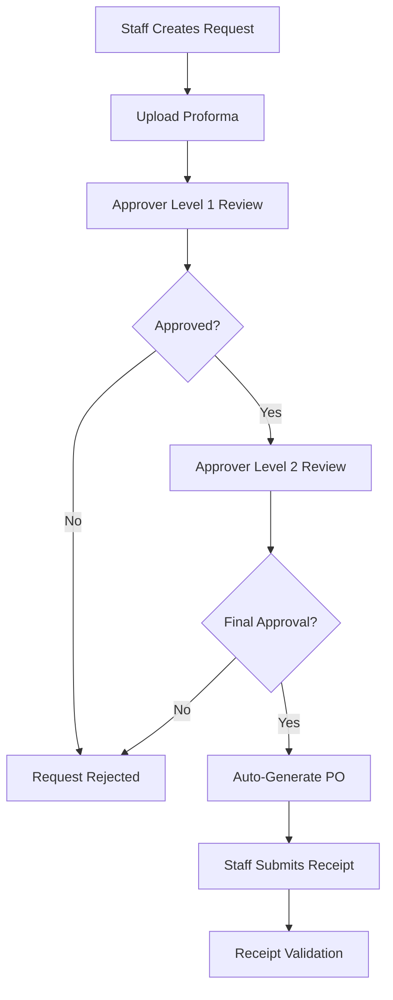

# 🏢 Procure-to-Pay System

[](https://djangoproject.com/)
[](https://reactjs.org/)
[](https://www.typescriptlang.org/)
[](https://www.docker.com/)
[](LICENSE)

A comprehensive **Procure-to-Pay** system with Django REST API backend and React TypeScript frontend, featuring multi-level approval workflows and AI-powered document processing.


## ✨ Features

### 🔐 Authentication & Authorization
- Multi-role user system (Staff, Approver Level 1/2, Finance)
- JWT-based authentication
- Role-based access control (RBAC)

### 📋 Purchase Request Management
- Create and track purchase requests
- Multi-level approval workflow
- Status tracking (Pending → Approved/Rejected)
- Automatic Purchase Order generation

### 🤖 AI-Powered Document Processing
- OCR for image-based documents
- PDF text extraction
- Proforma and receipt validation
- Automatic data extraction

### 📁 File Management
- Secure file uploads
- Support for proformas, purchase orders, receipts
- Document validation and processing

## 🛠️ Tech Stack

<table>
<tr>
<td><strong>Backend</strong></td>
<td><strong>Frontend</strong></td>
<td><strong>Database & Cache</strong></td>
<td><strong>DevOps</strong></td>
</tr>
<tr>
<td>

- Django 4.2
- Django REST Framework
- JWT Authentication
- Celery
- pytesseract (OCR)
- pdfplumber

</td>
<td>

- React 18
- TypeScript
- Material-UI
- React Query
- Axios
- React Router

</td>
<td>

- PostgreSQL
- Redis
- File Storage

</td>
<td>

- Docker
- Docker Compose
</td>
</tr>
</table>

## 🚀 Quick Start

### Prerequisites
- [Docker](https://www.docker.com/) and Docker Compose
- [Git](https://git-scm.com/)

### 📦 Installation

1. **Clone the repository**
   ```bash
   git clone https://github.com/manziosee/procure-to-pay-system.git
   cd procure-to-pay-system
   ```

2. **Start the application**
   ```bash
   docker-compose up --build
   ```

3. **Access the applications**
   - 🌐 **Frontend**: http://localhost:3000
   - 🔧 **Backend API**: http://localhost:8000
   - 📚 **API Documentation**: http://localhost:8000/swagger/

### ⚙️ Initial Setup

1. **Create superuser**
   ```bash
   docker-compose exec backend python manage.py createsuperuser
   ```

2. **Run database migrations**
   ```bash
   docker-compose exec backend python manage.py migrate
   ```

## 📡 API Endpoints

| Method | Endpoint | Description | Access |
|--------|----------|-------------|--------|
| `POST` | `/api/auth/login/` | User authentication | Public |
| `GET` | `/api/auth/profile/` | Get user profile | Authenticated |
| `GET` | `/api/requests/` | List requests (role-filtered) | Authenticated |
| `POST` | `/api/requests/` | Create new request | Staff |
| `GET` | `/api/requests/{id}/` | Get request details | Authenticated |
| `PATCH` | `/api/requests/{id}/approve/` | Approve request | Approvers |
| `PATCH` | `/api/requests/{id}/reject/` | Reject request | Approvers |
| `POST` | `/api/requests/{id}/submit_receipt/` | Submit receipt | Staff |
| `POST` | `/api/documents/process/` | Process document | Authenticated |

## 👥 User Roles & Permissions

| Role | Permissions |
|------|-------------|
| **👤 Staff** | • Create purchase requests<br>• View own requests<br>• Submit receipts<br>• Upload proformas |
| **✅ Approver Level 1** | • Review pending requests<br>• Approve/reject requests<br>• View request history |
| **✅ Approver Level 2** | • Final approval authority<br>• Review Level 1 approved requests<br>• Generate purchase orders |
| **💰 Finance** | • View all requests<br>• Access financial reports<br>• Monitor budget compliance |

## 🔄 Approval Workflow



**Process Steps:**
1. 📝 Staff creates purchase request with proforma
2. 👀 Request goes to Approver Level 1
3. ✅ If approved, moves to Approver Level 2
4. 🏁 Final approval triggers automatic PO generation
5. 🧾 Staff submits receipt for validation

## 🔧 Configuration

### Environment Variables

Create `.env` file in the `backend/` directory:

```env
# Django Settings
SECRET_KEY=your-secret-key-here
DEBUG=True
ALLOWED_HOSTS=localhost,127.0.0.1

# Database
DB_NAME=procure_to_pay
DB_USER=postgres
DB_PASSWORD=postgres
DB_HOST=db
DB_PORT=5432

# Redis
REDIS_URL=redis://redis:6379

# AI Services
OPENAI_API_KEY=your-openai-api-key

# CORS (for frontend)
CORS_ALLOWED_ORIGINS=http://localhost:3000
```

## 💻 Development

### Backend Development
```bash
cd backend
python -m venv venv
source venv/bin/activate  # On Windows: venv\Scripts\activate
pip install -r requirements.txt
python manage.py migrate
python manage.py runserver
```

### Frontend Development
```bash
cd frontend
npm install
npm start
```

### Running Tests
```bash
# Backend tests
docker-compose exec backend python manage.py test

# Frontend tests
docker-compose exec frontend npm test
```

## 🚀 Deployment

The system is containerized and ready for deployment on:

- ☁️ **AWS EC2** - Full control VPS
- 🌐 **Render** - Easy deployment
- ✈️ **Fly.io** - Global edge deployment
- 🌊 **DigitalOcean** - Developer-friendly VPS
- 🐳 **Any Docker-compatible platform**

### Production Deployment
```bash
# Set production environment
export DJANGO_SETTINGS_MODULE=procure_to_pay.settings.production

# Build and deploy
docker-compose -f docker-compose.prod.yml up --build -d
```

## 🤝 Contributing

1. Fork the repository
2. Create your feature branch (`git checkout -b feature/AmazingFeature`)
3. Commit your changes (`git commit -m 'Add some AmazingFeature'`)
4. Push to the branch (`git push origin feature/AmazingFeature`)
5. Open a Pull Request

## 📞 Support

If you have any questions or need help, please:
- 📧 Open an issue on GitHub
- 💬 Start a discussion
- 📖 Check the [documentation](https://github.com/manziosee/procure-to-pay-system/wiki)


---

<div align="center">
  <strong>⭐ Star this repository if you find it helpful!</strong><br>
  Made with ❤️ by <a href="https://github.com/manziosee">@manziosee</a>
</div>